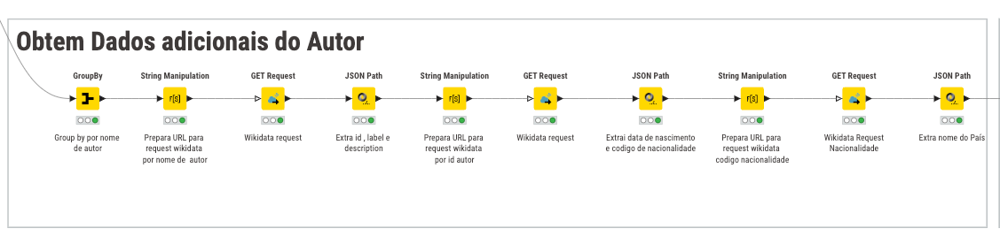

# Projeto de Integração de Sistemas de Informação: Análise de Livros e Autores

## Índice

1. [Enquadramento](#1-enquadramento)
2. [Problema](#2-problema)
3. [Estratégia Utilizada](#3-estrat%C3%A9gia-utilizada)
   3.1. [Extração de Dados (Extract)](#31-extra%C3%A7%C3%A3o-de-dados-extract)
   3.2. [Transformação de Dados (Transform)](#32-transforma%C3%A7%C3%A3o-de-dados-transform)
   3.3. [Integração e Merging de Dados](#33-integra%C3%A7%C3%A3o-e-merging-de-dados)
   3.4. [Carregamento e Exportação de Dados (Load)](#34-carregamento-e-exporta%C3%A7%C3%A3o-de-dados-load)
   3.5. [Visualização e Análise](#35-visualiza%C3%A7%C3%A3o-e-an%C3%A1lise)
4. [Transformações](#4-transforma%C3%A7%C3%B5es)
   4.1. [Normalização de Dados do Autor](#41-normaliza%C3%A7%C3%A3o-de-dados-do-autor)
   4.2. [Obtenção de Dados Adicionais do Autor](#42-obten%C3%A7%C3%A3o-de-dados-adicionais-do-autor)
   4.3. [Normalização de Dados do Livro](#43-normaliza%C3%A7%C3%A3o-de-dados-do-livro)
5. [Conclusão e Trabalhos Futuros](#5-conclus%C3%A3o-e-trabalhos-futuros)
   5.1. [Resumo dos Objetivos Alcançados](#51-resumo-dos-objetivos-alcan%C3%A7ados)
   5.2. [Desafios Enfrentados](#52-desafios-enfrentados)
   5.3. [Possíveis Melhorias Futuras](#53-poss%C3%ADveis-melhorias-futuras)
6. [Instruções de uso](#6-instru%C3%A7%C3%B5es-de-uso)
7. [Referências Bibliográficas](#7-refer%C3%AAncias-bibliogr%C3%A1ficas)


## 1. Enquadramento

- **Aluno:** Hugo Poças
- **Número:** 26339
- **Unidade Curricular:** Integração de Sistemas de Informação
- **Curso:** Licenciatura em Engenharia de Sistemas Informáticos


## 2. Problema

O projeto visa criar um sistema de ETL (Extract, Transform, Load) para processar e analisar dados de livros e autores. O objetivo é demonstrar a capacidade de integrar dados de várias fontes, normalizá-los, enriquecê-los com informações adicionais e apresentá-los em formatos úteis para análise.


## 3. Estratégia Utilizada

Para abordar o problema, foi desenvolvida uma estratégia utilizando a plataforma KNIME. A estratégia foi estruturada nas seguintes etapas:

### 3.1. Extração de Dados (Extract)
- Utilização de nós "CSV Reader" para importar dados iniciais de livros de um arquivo CSV e a API key do Google Books.
- Implementação de nós "GET Request" para aceder a APIs externas (Google Books API e Wikidata)

### 3.2. Transformação de Dados (Transform)
- Aplicação de diversos nós de "String Manipulation" para normalização e limpeza de dados, incluindo:
  - Padronização de formatos de data
  - Normalização de nomes de autores, idiona e títulos de livros
- Uso de Expressões Regulares (ER) para extração e tratamento de dados
- Implementação de nodes "GroupBy" para agregar dados por autor e realizar cálculos de produtividade.
- Utilização de nodes "Math Formula" para cálculos, como idade do autor na publicação e intervalo entre publicações.
- Aplicação de nodes "Rule Engine" para categorização de livros baseado em critérios como número de páginas.

### 3.3. Integração e Merging de Dados
- Uso de nós "Joiner" para combinar dados de diferentes fontes, integrando informações de livros e autores.
- Implementação de nós "Concatenate" para unir conjuntos de dados processados separadamente.

### 3.4. Carregamento e Exportação de Dados (Load)
- Utilização de nodes "JSON Writer", "XML Writer", e "CSV Writer" para exportar os dados processados em múltiplos formatos
- Implementação de nodes de ligação com uma base de dados armazenamento

### 3.5. Visualização e Análise
- Uso de nodes "Histogram" e "Pie Chart" para criar visualizações básicas de distribuições de dados, como número de páginas dos livros e decada de publicação.


Esta estratégia permitiu a criação de um sistema ETL robusto, capaz de processar, enriquecer e analisar dados de livros e autores de forma eficiente e flexível, atendendo aos requisitos do projeto e demonstrando a aplicação prática de conceitos de integração de sistemas de informação.

## 4. Transformações

### 4.1 Normalização de Dados do Autor


Neste processo, realizei as seguintes etapas de normalização:

1. **Limpeza do Local de Nascimento**: Usado um node String Manipulation para padronizar o formato dos locais de nascimento, removendo caracteres as aspas e pelicas

2. **Normalização da Data de Nascimento**: 
Implementamos um nó String Manipulation com uma expressão regular para extrair e padronizar a data de nascimento no formato YYYY-MM-DD. A expressão utilizada foi:

```
string(
    regexReplace($autor_data_nasciment$, ".(\d{4})-(\d{2})-(\d{2}).", "$1-$2-$3")
)
```

3. **Extração do Ano de Nascimento**: Após normalizar a data de nascimento, um terceiro nó de String Manipulation é usado para extrair apenas o ano de nascimento. Isso é útil para cálculos de idade e análises temporais. A expressão provavelmente seria algo como:

4. **Remoção de Dados Redundantes**: Aplicamos um nó Column Filter para eliminar colunas duplicadas ou desnecessárias após o processo de normalização.

Este processo garante que os dados dos autores estejam em um formato consistente e limpo, preparando-os para integração com os dados dos livros

### 4.2 Obtenção de Dados Adicionais do Autor



Este processo serve para enriquecer os dados dos autores utilizando a API do Wikidata.

1. **Group by por nome de autor**: 
   Utilizado um node GroupBy para agrupar os dados por nome de autor. Isto serve para evitar pedidos duplicados à API e otimiza o processo.

2. **Prepara URL para request wikidata por nome de autor**:
   Um node String Manipulation é usado para construir a URL de consulta à API do Wikidata, incorporando o nome do autor.

3. **Wikidata request**:
   Um node GET Request é utilizado para fazer a chamada à API do Wikidata com a URL preparada.

4. **Extrai id, label e description**:
   Um node JSON Path extrai informações básicas (ID, label e descrição) da resposta da API do Wikidata.

5. **Prepara URL para request wikidata por id autor**:
   Agora com o ID que obtivemos da primeira resposta, preparar um novo URL

6. **Wikidata request**:
   Um segundo node GET Request é usado para obter informações mais detalhadas sobre o autor usando seu ID Wikidata.

7. **Extrai data de nascimento e código de nacionalidade**:
   Um node JSON Path extrai a data de nascimento e o código de nacionalidade da resposta do Wikidata.

8. **Prepara URL para request wikidata código nacionalidade**:
   Um terceiro node String Manipulation prepara uma URL para consultar informações sobre a nacionalidade do autor.

9. **Wikidata Request Nacionalidade**:
   Um terceiro node GET Request é usado para obter informações sobre a nacionalidade do autor.

10. **Extrai nome do País**:
    Um último node JSON Path extrai o nome do país correspondente à nacionalidade do autor.

Este processo demonstra uma abordagem sistemática para enriquecer os dados dos autores, fazendo uso eficiente de APIs externas e processando as respostas JSON para extrair informações relevantes. A sequência de consultas permite obter dados detalhados e precisos sobre cada autor, incluindo a nacionalidade

### 4.3 Normalização de Dados do Livro


Este processo serve para normalizar os dados do livro, envolve algumas etapas de manipulação de strings que servem para padronizar e enriquecer as informações.

1. **Normaliza o ano de publicação**:
   Utilizado um node String Manipulation para padronizar o formato do ano de publicação. Usada uma regex para extrair apenas os valores do ano.

2. **Normaliza título do livro**:
    São retirados os espaços em branco do fim e do inicio(trim) e todos os espaços em sequencia. 

3. **Normaliza linguagem para apenas 2 chars**:
   Aqui são convertidos os códigos das línguas em códigos de duas letras (por exemplo, "en-US" para "en"). Isso padroniza a representação das línguas e facilita outras análises.

4. **Normalizar a linguagem para ficar por extenso**:
    Agora que as linguagens estão padronizadas para 2 caracteres, neste node fazemos comparacao com uma lista de códigos para atribuir a linguagem por extenso, se não estiver listada fica como `Outro`.

5. **Extrai a década de publicação do livro**:
   Aqui, um node Math Formula é para calcular a década de publicação a partir do ano normalizado.

Este processo de normalização garante que os dados dos livros estejam em um formato consistente e enriquecido, facilitando análises subsequentes e melhorando a qualidade geral do conjunto de dados.


## 5. Conclusão e Trabalhos Futuros

### 5.1 Resumo dos Objetivos Alcançados

Este projeto alcançou com sucesso os seguintes objetivos:

1. Implementação de um sistema ETL robusto para processar dados de livros e autores.
2. Integração bem-sucedida de dados de múltiplas fontes, incluindo arquivos CSV locais e APIs externas (Google Books e Wikidata).
3. Normalização e enriquecimento eficazes dos dados, melhorando significativamente a qualidade e utilidade das informações.
4. Demonstração prática de técnicas avançadas de manipulação de dados usando KNIME, incluindo o uso de expressões regulares e manipulação de strings.
5. Criação de um fluxo de trabalho modular e expansível para futuras melhorias e adaptações.

### 5.2 Desafios Enfrentados

Durante o desenvolvimento do projeto, enfrentei diversos desafios:

1. Lidar com inconsistências nos formatos de dados provenientes de diferentes fontes.
2. Integrar eficientemente múltiplas chamadas de API sem exceder rate limits.
3. Otimizar o desempenho do fluxo de trabalho para lidar com grandes volumes de dados.

### 5.3 Possíveis Melhorias Futuras

Para futuros desenvolvimentos, identifiquei algumas áreas de melhoria e expansão:

1. Pesquisar sempre pela primeira edição do livro para calcular corretamente a idade do autor na publicação. Dessa forma, seria possível análise mais precisa da carreira do autor.

2. Implementar uma verificação do status vital do autor (vivo ou falecido) para evitar cálculos de idade irrealistas e permitir análises mais precisas da produção.

3. Expandir para incluir informações detalhadas sobre todos os autores de um livro, não apenas o autor principal.

4. Criar uma user interface para facilitar a interação com o sistema ETL 

## 6. Instruções de uso

Foi utilizada a versão Knime 5.3.2

### Preparação dos Dados

1. Criar um ficheiro `books.csv` com as seguintes colunas:
   - `titulo`: Título do livro
   - `isbn`: ISBN do livro
   
   Exemplo:
   ```csv
    titulo,isbn
    "O Senhor dos Anéis",9788533613404
    "1984",9788535914849
   ```
2. Crie um ficheiro `keys.json` com a chave API do Google Books:
```json
{
  "google_books_api_key": "CHAVE_API_AQUI"
}
```

#### Importando o Fluxo de Trabalho

1. Abrir o KNIME
2. File > Import KNIME Workflow
3. Selecionar o ficheiro Analise_Livros_Autores.knwf do projeto

#### Configurando o Fluxo de Trabalho

1. No nó "CSV Reader", configurar o caminho para o ficheiro books.csv
2. No nó "JSON Reader", configurar o caminho para o ficheiro keys.json
3. Verificar se todos os caminhos de saída (para JSON, XML, CSV) estão configurados corretamente

## 7. Referências Bibliográficas

1. [Documentação do KNIME](https://docs.knime.com/)
2. [Documentação da API do Google Books](https://developers.google.com/books)
3. [Documentação da API do Wikidata](https://www.wikidata.org/wiki/Wikidata:Data_access)